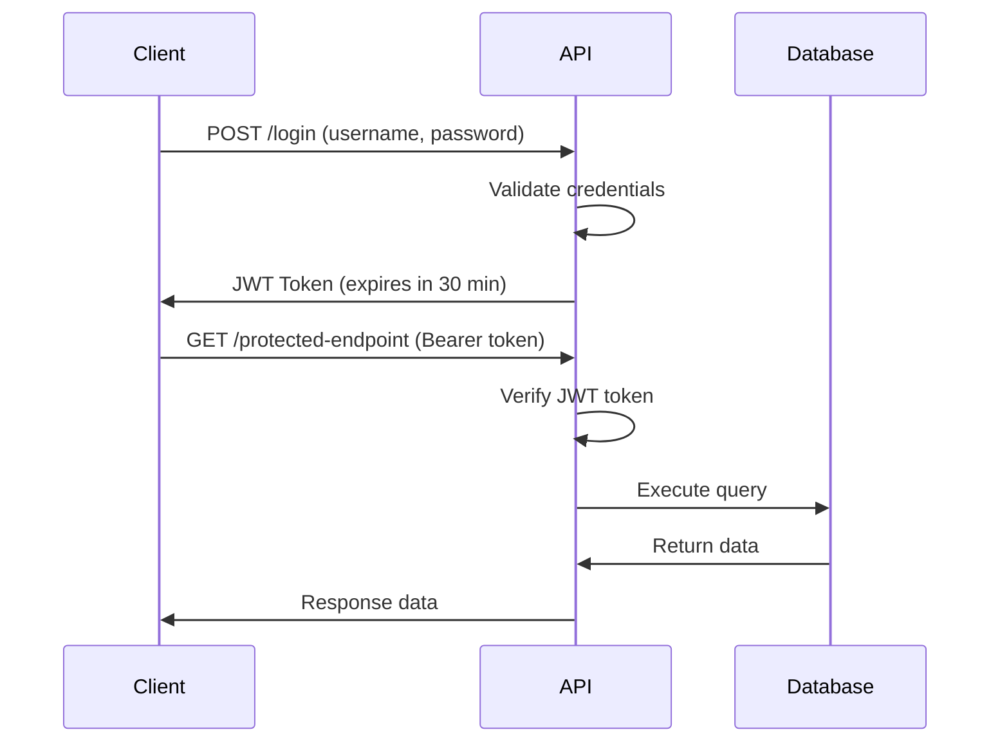

# 🔐 Greenspot Grocer API - Authentication Guide

> **Complete guide to authentication, authorization, and security for the Greenspot Grocer Analytics API**

## 🎯 Overview

The Greenspot Grocer Analytics API uses **JWT (JSON Web Token)** based authentication with Bearer token authorization. All protected endpoints require a valid JWT token to access business analytics data.

## 🔑 Authentication Flow



## 🚀 Quick Start

### 1. **Login and Get Token**

**Endpoint:** `POST /login`

**Request:**
```bash
curl -X POST "http://127.0.0.1:8000/login" \
     -H "Content-Type: application/json" \
     -d '{"username":"admin","password":"admin123"}'
```

**Response:**
```json
{
  "access_token": "eyJhbGciOiJIUzI1NiIsInR5cCI6IkpXVCJ9...",
  "token_type": "bearer",
  "expires_in": 1800
}
```

### 2. **Use Token for Protected Endpoints**

**Request:**
```bash
curl -X GET "http://127.0.0.1:8000/executive-summary" \
     -H "Authorization: Bearer YOUR_TOKEN_HERE"
```

## 📋 Authentication Details

### **Login Endpoint**

| Property | Value |
|----------|-------|
| **URL** | `/login` |
| **Method** | `POST` |
| **Content-Type** | `application/json` |
| **Authentication** | None (public endpoint) |

**Request Body:**
```json
{
  "username": "string",
  "password": "string"
}
```

**Success Response (200):**
```json
{
  "access_token": "string",
  "token_type": "bearer",
  "expires_in": 1800
}
```

**Error Response (401):**
```json
{
  "detail": "Invalid username or password"
}
```

### **Default Credentials**

| Field | Value | Environment Variable |
|-------|-------|---------------------|
| **Username** | `admin` | `ADMIN_USERNAME` |
| **Password** | `admin123` | `ADMIN_PASSWORD` |

> **🔒 Security Note**: In production, credentials should be stored securely and passwords should be hashed.

## 🛡️ Token Usage

### **Bearer Token Format**
```
Authorization: Bearer <your_jwt_token>
```

### **Token Properties**
- **Type**: JWT (JSON Web Token)
- **Algorithm**: HS256
- **Expiration**: 30 minutes (1800 seconds)
- **Issuer**: Greenspot Grocer API
- **Subject**: Username

### **Token Payload Example**
```json
{
  "sub": "admin",
  "exp": 1700000000
}
```

## 🔒 Protected Endpoints

All analytics endpoints require authentication:

| Endpoint | Method | Description |
|----------|--------|-------------|
| `/executive-summary` | GET | Business overview metrics |
| `/product-performance` | GET | Product sales analytics |
| `/customer-insights` | GET | Customer behavior data |
| `/inventory-status` | GET | Current inventory levels |

## 📝 Implementation Examples

### **JavaScript/Fetch**
```javascript
// Login
const loginResponse = await fetch('http://127.0.0.1:8000/login', {
  method: 'POST',
  headers: {
    'Content-Type': 'application/json',
  },
  body: JSON.stringify({
    username: 'admin',
    password: 'admin123'
  })
});

const { access_token } = await loginResponse.json();

// Use token
const dataResponse = await fetch('http://127.0.0.1:8000/executive-summary', {
  headers: {
    'Authorization': `Bearer ${access_token}`
  }
});

const data = await dataResponse.json();
```

### **Python/Requests**
```python
import requests

# Login
login_data = {
    "username": "admin",
    "password": "admin123"
}

response = requests.post(
    "http://127.0.0.1:8000/login",
    json=login_data
)

token = response.json()["access_token"]

# Use token
headers = {"Authorization": f"Bearer {token}"}
data_response = requests.get(
    "http://127.0.0.1:8000/executive-summary",
    headers=headers
)

data = data_response.json()
```

### **PowerShell**
```powershell
# Login
$loginBody = @{
    username = "admin"
    password = "admin123"
} | ConvertTo-Json

$response = Invoke-RestMethod -Uri "http://127.0.0.1:8000/login" `
                             -Method POST `
                             -ContentType "application/json" `
                             -Body $loginBody

$token = $response.access_token

# Use token
$headers = @{Authorization = "Bearer $token"}
$data = Invoke-RestMethod -Uri "http://127.0.0.1:8000/executive-summary" `
                         -Method GET `
                         -Headers $headers
```

### **cURL**
```bash
# Login and extract token
TOKEN=$(curl -s -X POST "http://127.0.0.1:8000/login" \
     -H "Content-Type: application/json" \
     -d '{"username":"admin","password":"admin123"}' | \
     grep -o '"access_token":"[^"]*' | \
     grep -o '[^"]*$')

# Use token
curl -X GET "http://127.0.0.1:8000/executive-summary" \
     -H "Authorization: Bearer $TOKEN"
```

## ⚠️ Error Handling

### **Common Authentication Errors**

**401 Unauthorized - Invalid Credentials**
```json
{
  "detail": "Invalid username or password"
}
```

**401 Unauthorized - Invalid Token**
```json
{
  "detail": "Invalid credentials"
}
```

**403 Forbidden - Missing Token**
```json
{
  "detail": "Not authenticated"
}
```

**422 Validation Error - Malformed Request**
```json
{
  "detail": [
    {
      "loc": ["body", "username"],
      "msg": "field required",
      "type": "value_error.missing"
    }
  ]
}
```

## 🔄 Token Refresh

**Current Implementation**: Tokens expire after 30 minutes. When a token expires, clients must re-authenticate using the `/login` endpoint.

**Best Practice**: Implement automatic token refresh in your client applications:

```javascript
// Example token refresh logic
async function makeAuthenticatedRequest(url) {
  try {
    const response = await fetch(url, {
      headers: { 'Authorization': `Bearer ${currentToken}` }
    });
    
    if (response.status === 401) {
      // Token expired, refresh
      await login();
      return makeAuthenticatedRequest(url);
    }
    
    return response;
  } catch (error) {
    console.error('Request failed:', error);
  }
}
```

## 🛠️ Development & Testing

### **Interactive Testing**
Visit `http://127.0.0.1:8000/docs` for Swagger UI testing:

1. Click **"Authorize"** button
2. Enter credentials in login endpoint
3. Copy the returned token
4. Use "Authorize" with `Bearer <token>`
5. Test protected endpoints

### **Environment Configuration**

Set these environment variables for custom configuration:

```bash
# Credentials
export ADMIN_USERNAME="your_admin_user"
export ADMIN_PASSWORD="your_secure_password"

# JWT Settings
export JWT_SECRET_KEY="your_secret_key"
export JWT_ALGORITHM="HS256"
export JWT_EXPIRE_MINUTES="30"

# API Settings
export API_HOST="127.0.0.1"
export API_PORT="8000"
```

## 🔐 Security Best Practices

### **For Development**
- ✅ Use the provided default credentials
- ✅ Test with short-lived tokens
- ✅ Use HTTPS in production
- ✅ Validate all requests

### **For Production**
- 🔒 **Never use default credentials**
- 🔒 **Use environment variables for secrets**
- 🔒 **Implement password hashing (bcrypt)**
- 🔒 **Use strong JWT secret keys**
- 🔒 **Enable CORS restrictions**
- 🔒 **Implement rate limiting**
- 🔒 **Log authentication attempts**
- 🔒 **Use HTTPS only**

### **Token Security**
- Store tokens securely (not in localStorage for web apps)
- Implement token rotation
- Use short expiration times
- Clear tokens on logout
- Validate tokens on every request

## 📊 Authentication Monitoring

### **Logging**
The API logs authentication events:
- Successful logins
- Failed authentication attempts
- Token validation failures
- Expired token usage

### **Health Check**
The `/health` endpoint can be used to verify API availability without authentication.

## 🆘 Troubleshooting

### **Common Issues**

**1. "405 Method Not Allowed" on /login**
- **Cause**: Using GET instead of POST
- **Solution**: Use `POST /login` with JSON body

**2. "Invalid username or password"**
- **Cause**: Wrong credentials
- **Solution**: Use `admin` / `admin123` or check environment variables

**3. "Not authenticated"**
- **Cause**: Missing or invalid Authorization header
- **Solution**: Include `Authorization: Bearer <token>` header

**4. Token expired errors**
- **Cause**: Token older than 30 minutes
- **Solution**: Re-authenticate to get a new token

**5. "Invalid credentials" with valid token**
- **Cause**: Malformed Authorization header
- **Solution**: Ensure format is exactly `Bearer <token>`

## 📚 Additional Resources

- **API Documentation**: `/docs` - Interactive Swagger UI
- **OpenAPI Spec**: `/openapi.json` - Machine-readable API specification
- **Health Check**: `/health` - API status and connectivity
- **Main Documentation**: `README.md` - Complete project overview

---

## 🎉 Quick Test

Test your authentication setup:

```bash
# Test login
curl -X POST "http://127.0.0.1:8000/login" \
     -H "Content-Type: application/json" \
     -d '{"username":"admin","password":"admin123"}'

# Should return: {"access_token":"...","token_type":"bearer","expires_in":1800}
```

✅ **Your Greenspot Grocer API authentication is ready to use!**